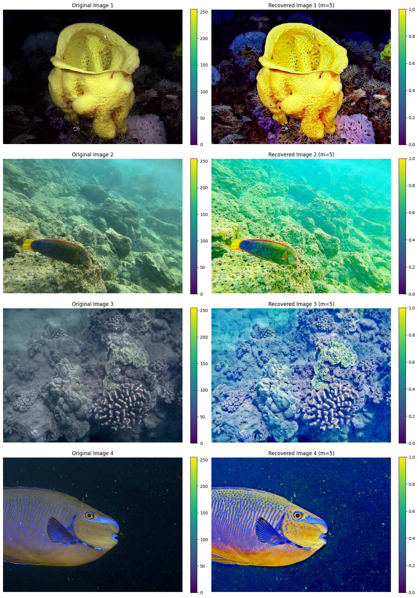
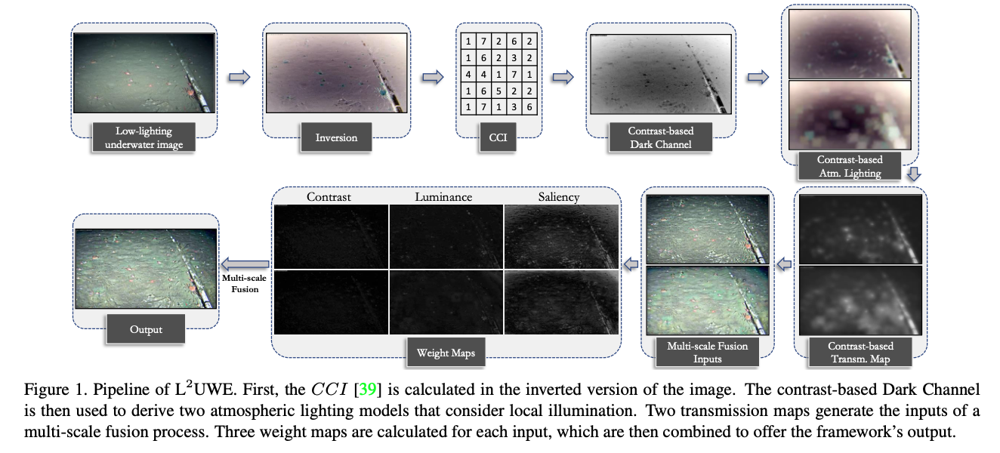

# Underwater-Image-Quality-Enhancement-L2UWE

This repository implements the image enhancement pipeline described in the paper:

> [**L²UWE: A Framework for the Efficient Enhancement of Low-Light Underwater Images Using Local Contrast and Multi-Scale Fusion**](https://arxiv.org/abs/2005.13736)  
> *Tunai Porto Marques & Alexandra Branzan Albu, University of Victoria*

I reproduced this work in 2023 under the supervision of **Professor Alexandra Branzan Albu** during my time at the University of Victoria. The implementation showcases a step-by-step approach to enhancing low-light underwater images using local contrast and adaptive multi-scale fusion strategies.

---

## Project Background

Underwater imagery often suffers from poor visibility, low contrast, and non-uniform illumination due to light absorption and scattering in water. Enhancing these images is crucial for applications in:

- Marine biology & ecosystem monitoring  
- Underwater robotics & autonomous navigation  
- Archaeological site preservation  
- Industrial inspections of submerged infrastructure

This project implements an efficient and interpretable framework for enhancing low-light underwater images using **local contrast estimation** and **multi-scale fusion**. Unlike black-box deep learning models, this method is grounded in physical intuition and image formation theory.

> Original Images V.S. Processed Images can be previewed as listed below:

<div align="center">
  
</div>

---

## What I Learned

Through this implementation, I:

- Read and interpreted multiple research papers in underwater image processing  
- Improved my **research skills**, including literature review and algorithm validation  
- Gained a solid foundation in **computer vision**, specifically:
  - Image inversion and contrast analysis  
  - Dark channel prior & transmission maps  
  - Atmospheric light modeling  
  - Patch-wise adaptive filtering and multi-scale analysis

This hands-on research helped bridge theory with implementation and deepened my understanding of image enhancement challenges in real-world environments.

---

## About This Implementation

The original implementation of L²UWE was developed in **MATLAB**. This repository provides a **Python-based reimplementation** based solely on the methodology and equations described in the original paper.

All components were recreated from scratch using OpenCV, NumPy, and Matplotlib, with a strong emphasis on:

- Code clarity
- Educational visualization
- Faithful adherence to the paper’s pipeline

This reimplementation allowed me to deepen my understanding of image formation models, local contrast theory, and underwater image enhancement techniques through direct engagement with the algorithmic design.

## Features

- Local contrast estimation using adaptive patch sizes  
- Contrast-Consistent Index (CCI) map generation  
- Dark channel computation  
- Contrast-guided atmospheric light refinement  
- Transmission map estimation  
- Multi-scale radiance recovery  
- Step-by-step visualizations for educational debugging

<div align="center">
  
</div>

This implementation is based on the method proposed by Marques and Albu[2].

---

## File Structure

This section provides a detailed overview of the project directory structure to help you understand where key files and resources are located.

```text
.
├── .venv/                                # (Optional) Local Python virtual environment
├── data/
│   ├── additional-data.zip.csv           # Additional dataset used for experimentation
│   ├── sample-1.jpg                      # Sample input testing image 1
│   ├── sample-2.jpg                      # Sample input testing image 2
│   ├── sample-3.jpg                      # Sample input testing image 3
│   └── sample-4.jpg                      # Sample input testing image 4
├── images/                               # Conceptual illustrations and visual outputs
│   ├── L2UWE-pipeline.png                # Pipeline diagram
│   └── output.png                        # Side-by-side results of original vs. enhanced images
├── lib/
│   └── image_enhancement_pipeline.py     # Modular implementation of the L²UWE pipeline
├── project-report/
│   ├── L2UWE-Presentation-Slides.pptx    # Final presentation slides
│   └── ProjectReport=AlexTian.pdf        # Project report document
├── reference-papers/
│   ├── L2UWE-original-paper.pdf          # Original paper in PDF format
│   └── Other reference resources         
├── .gitignore                            # Ignore Python environment files and caches
├── L2UWE-Framework.ipynb                 # Jupyter notebook for step-by-step demonstration
├── LICENSE                               # MIT License
├── README.md                             # You are here
└── requirements.txt                      # Python dependencies for reproducibility
```

---

## Development Environment Setup (with Virtual Environment)

> Note: These instructions are for macOS. Setup may differ slightly on Windows.

### Recommended Configuration

- Operating System: MacOS

- Recommended Python Version: 3.12.4

- Integrated Development Environment: Visual Studio Code (VS Code)

---

### 1. Creating Virtual Environment

Open your terminal in the project root directory and run:

```bash
python3 -m venv .venv
```

> It’s common practice to name the environment .venv. Most certainly, you could rename it accordingly.

To open a terminal in VS Code, use the shortcut: Ctrl + backtick (`)

---

### 2. Active the Virtual Environment(On Windows, the activation command may differ)

Run the following command in your terminal:

```bash
source .venv/bin/activate
```

---

### 3. Select the Python Interpreter in VS Code

Step 1: Press **`Cmd + Shift + P`** to open the Command Palette  

Step 2: Search for: **`Python: Select Interpreter`**  

Step 3: Choose the one that points to `./.venv`

---

### 4. Install `ipykernel` (Recommended Version: 6.29.5)

```bash
pip install ipykernel==6.29.5
```

> To verify or check your ipykernel installation version: `pip show ipykernel`

---

### 5. Install Project Dependencies

Install all required packages from the `requirements.txt`:

```bash
pip install -r requirements.txt
```

> You can modify or create your own environment by `pip freeze > requirements.txt`  
> you can use command `pip list` to list all installed packages

---


## References

1. **USR-248 Dataset**  
   *USR-248 Dataset | Minnesota Interactive Robotics and Vision Laboratory*.  
   [https://irvlab.cs.umn.edu/resources/usr-248-dataset](https://irvlab.cs.umn.edu/resources/usr-248-dataset)

2. **L²UWE: A Framework for the Efficient Enhancement of Low-Light Underwater Images Using Local Contrast and Multi-Scale Fusion**  
   Tunai Porto Marques and Alexandra Branzan Albu.  
   *arXiv.org, 2020*.  
   [https://arxiv.org/abs/2005.13736](https://arxiv.org/abs/2005.13736)

3. **Single Image Haze Removal Using Dark Channel Prior**  
   Kaiming He, Jian Sun, and Xiaoou Tang.  
   *IEEE Transactions on Pattern Analysis and Machine Intelligence, 33(12):2341–2353, 2011*.

4. **A Contrast-Guided Approach for the Enhancement of Low-Lighting Underwater Images**  
   Tunai Porto Marques, Alexandra Branzan Albu, and Maia Hoeberechts.  
   *Journal of Imaging, 5(10):79, 2019*.

5. **Under Water Image Enhancement by Fusion**  
   *UGC Approved Journal*.  
   [http://www.ijmer.com/pages/Vol.4-Iss.4(Version-4).html](http://www.ijmer.com/pages/Vol.4-Iss.4(Version-4).html)

6. **Single Image Dehazing by Multi-Scale Fusion**  
   Codruta Orniana Ancuti and Cosmin Ancuti.  
   *IEEE Transactions on Image Processing, 22(8):3271–3282, 2013*.

7. **PUIQE: Platform for Underwater Image Quality Evaluation**  
   [https://puiqe.eecs.qmul.ac.uk/](https://puiqe.eecs.qmul.ac.uk/)

## License

This project is intended for academic and educational purposes only.  
All rights to the original methodology belong to the authors.